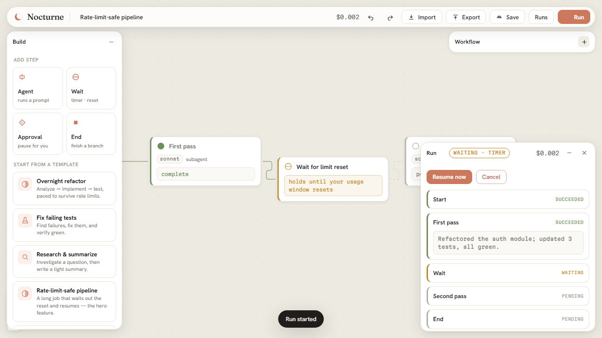
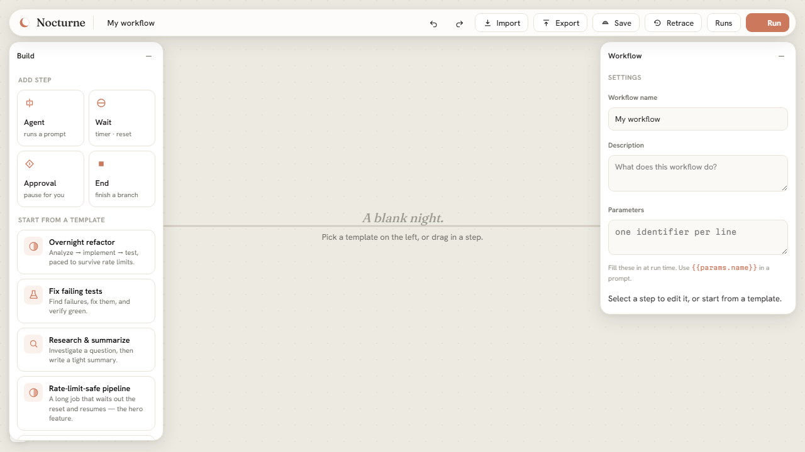
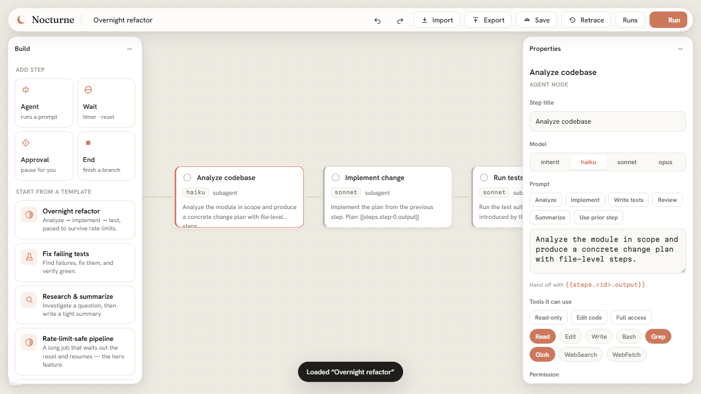
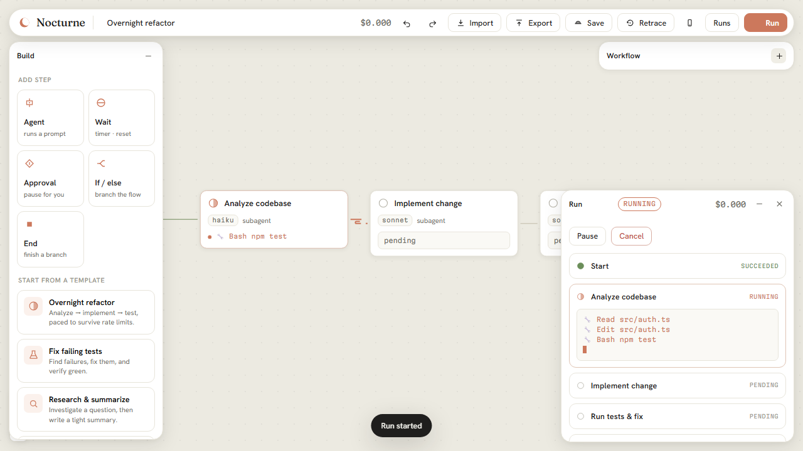
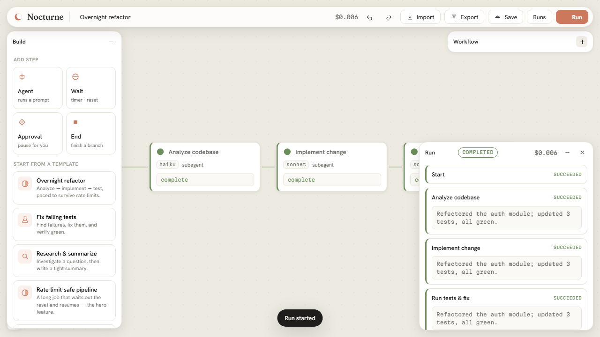
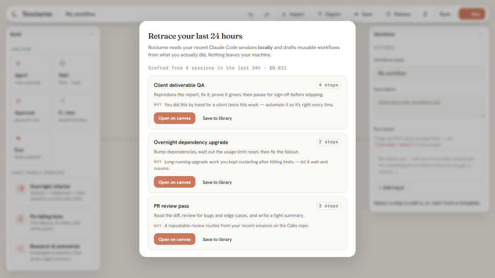
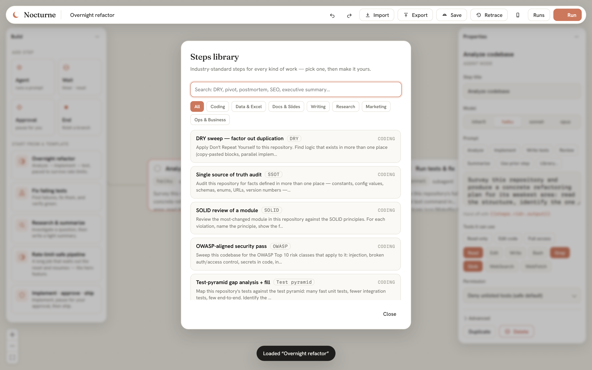
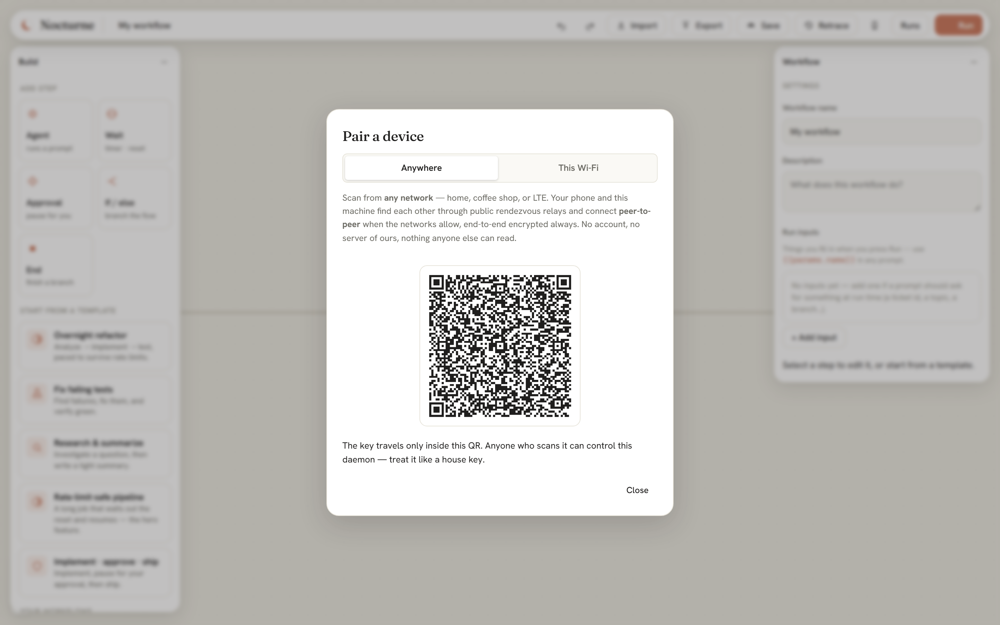
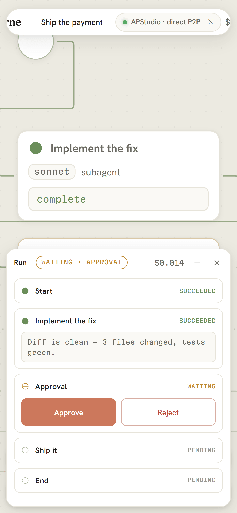
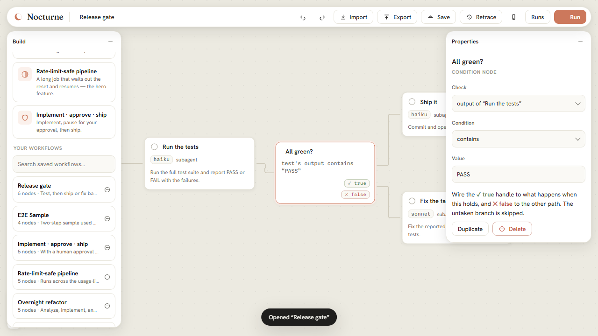

# Nocturne

**Design multi-agent Claude Code workflows on a canvas. Run them while you sleep — durably, locally, on the subscription you already pay for.**

🌐 **[nocturne website & walkthrough →](https://muhamadjawdatsalemalakoum.github.io/nocturne/)**

Nocturne is a local-first workflow runner for [Claude Code](https://code.claude.com). You lay out a
multi-step agent pipeline on an infinite canvas — pick the model per step, drop in timed waits and
approval gates — then hit **Run**. Each step executes as its own Claude Code subagent, in its own
context, and hands its output to the next. If a run hits your usage limit at 2am, it **checkpoints,
waits for the window to reset, and resumes exactly where it stopped.**



## Why it exists

Anthropic split durability and control across two surfaces that don't overlap:

| | Anthropic cloud (Routines / web) | Anthropic local (CLI / Desktop) | **Nocturne** |
|---|---|---|---|
| Survives session close / sleep | ✅ | ❌ | ✅ |
| Runs in *your* environment (local files, MCP servers, toolchain) | ❌ fresh clone | ✅ | ✅ |
| Your permission rules, watchable | ❌ autonomous | ✅ | ✅ |
| Flat-rate subscription economics | capped + metered | ✅ | ✅ |
| Durable multi-step orchestration with waits + resume | partial | ❌ | ✅ |
| Visual design surface | ❌ | ❌ | ✅ |
| Turns your own session history into workflows | ❌ | ❌ | ✅ |

Native Claude Code workflows are autonomous **within a session** but die on exit, can't durably wait,
and can't pause for input and resume. Nocturne is the durability layer on top: **durable where the
native runtime is fragile, local where the cloud isn't, flat-rate where every other orchestrator meters
tokens** — with a canvas that has taste.

The hero feature and the economics are the same feature: unattended subscription execution is only
possible with an engine that checkpoints, waits out the reset, and resumes. That's the whole point.

## A full run, start to finish

**1. Start from a blank canvas and a library of one-click templates.**



**2. One click builds a whole pipeline — then tune each step with options, not typing.** Model is a
segmented control; prompts have one-tap starters; tools are preset bundles plus toggle chips;
permissions are a plain-language dropdown, with the rarely-needed knobs behind *Advanced*.



**3. Hit Run (it uses your existing `claude` login) and watch every agent work, live** — files read
and edited, commands run, cost ticking up, streamed onto the node and into the run panel.



**4. If it hits your usage limit, it holds on a limit-reset wait and resumes on its own** — the hero
feature. Come back to a completed pipeline, every step green with its output and total cost.



Other journeys — **human approval gates** ([08](docs/images/08-approval.png)), the **import review
dialog** that shows what a shared workflow can do before it runs
([09](docs/images/09-import-review.png)), and the **Figma-style minimizable panels**
([10](docs/images/10-minimized.png)) — are on the [website](https://muhamadjawdatsalemalakoum.github.io/nocturne/).

## Retrace — it writes your workflows for you

The hardest part of automation is noticing what's worth automating. **Retrace** does it for
you: click it and Nocturne reads your **last 24 hours of Claude Code sessions** — locally, from
`~/.claude/projects` — distills what you actually did, and drafts reusable workflows from the
patterns it finds. Something good happened with a client? It becomes a workflow you can run,
tune, and share — so you get it right every time, even on the days you're not focused.



Each suggestion arrives as a real, valid pipeline: pick **Open on canvas** to tweak it, or
**Save to library** to keep it. It's the same subscription-auth CLI the engine uses, so the
analysis runs on your plan, and **nothing leaves your machine** — the transcripts are read on
disk, obvious secrets are redacted before anything is sent to the model, and the model only
ever describes steps (Nocturne compiles the graph and validates every draft against the
`.nocturne.json` schema, dropping anything malformed).

How it works, end to end:

1. **Scan** — the daemon lists session transcripts touched in the window and skips the rest by
   modified-time before opening a single file.
2. **Distill** — each session becomes a compact, redacted digest: your prompts, the tools and
   files touched, commands run, models used.
3. **Draft** — a Claude subagent reads the digests and returns workflow *intent* as JSON.
4. **Compile & validate** — Nocturne turns that intent into positioned, wired, schema-valid
   graphs and shows you only the ones that pass.

## Quick start

```bash
npm install
npm run build:ui          # build the canvas
npm run serve             # start the daemon → http://localhost:5151
```

Open http://localhost:5151, design a workflow, and press **Run**. The daemon runs through your existing
`claude` login. For unattended runs that survive closing your terminal, set up a long-lived token:

```bash
claude setup-token        # then put it in ~/.nocturne/config.json as "oauthToken"
```

## Drive it from Claude (MCP)

Beyond the canvas, Nocturne ships an **MCP server** (`@nocturne/mcp`) so you can launch and check on
workflows **conversationally** — from Claude Code, Claude Desktop, Cursor, or any MCP client:

> *"List my Nocturne workflows and run the overnight-refactor on this repo."*
> *"How's that run doing?"* → *"It's waiting on the approval gate — approve it."*

It's a thin adapter over the same daemon, so a run you kick off from a chat keeps going after the
chat ends. Install it in Claude Code (CLI, desktop app, or IDE extension) straight from this repo:

```
/plugin marketplace add muhamadjawdatsalemalakoum/nocturne
/plugin install nocturne@nocturne
```

Full setup — Claude Code plugin + skill, Claude Desktop (`.mcpb` one-click extension or config),
and any MCP client — is in [integrations/README.md](integrations/README.md).

## Not just for coders — the steps library

The built-in **steps library** ships searchable, ready-to-run steps that encode named industry
practices across every kind of work — each one a complete brief with a definition of done:

- **Coding** — DRY sweeps, single-source-of-truth audits, SOLID reviews, OWASP security passes,
  test-pyramid gap fills, Conventional-Commits shipping
- **Data & Excel** — tidy-data cleaning, pivot analyses with the "so what", six-dimension
  data-quality gates
- **Docs & slides** — assertion-evidence deck outlines, BLUF executive summaries, SOPs
- **Writing, research, marketing, ops** — editing passes, MECE competitive maps, on-page SEO
  audits, blameless 5-Whys postmortems, OKRs that actually measure



Select any agent step → **Library…** → search or filter by category → one tap applies the prompt,
suggested model tier, and minimal tool grant.

## Take it anywhere — the peer-to-peer mobile companion

The first Claude Code plugin with a **peer-to-peer mobile companion** — and it is not LAN-bound.
Start the daemon with `nocturne serve --remote`, tap **Pair device**, scan the QR once, and your
phone can monitor and drive your workflows **from any network on earth**: home Wi-Fi, the office,
a coffee shop, LTE behind carrier NAT. No account, no port-forwarding, no server of ours.

| Pair by QR — Anywhere or this Wi-Fi | Monitor from your phone |
|---|---|
|  |  |

**How Anywhere works** (and why the claim survives scrutiny):

- The QR carries a 32-byte secret in the URL *fragment* — it never touches a server, a query
  string, or a log line. Every key derives from it.
- Phone and daemon find each other through **public rendezvous relays** (the same commons
  NIP-46 remote signers use) — both ends dial *out*, so it works from CGNAT/LTE by
  construction. Everything they exchange is **end-to-end encrypted** (AES-256-GCM under
  HKDF-derived directional keys); relays carry ciphertext they cannot read, ever.
- The moment the networks allow it, the two ends **upgrade themselves to a direct
  peer-to-peer WebRTC DataChannel** and leave the relays behind — full-fidelity live
  streaming, no middleman. When NATs won't cooperate, the encrypted relay floor keeps
  everything working. The console shows which tier you're on: **direct P2P** or
  **encrypted relay**.
- The phone console is a static page on GitHub Pages (this repo's `docs/app/`) — the same
  canvas UI, transport swapped. Add it to your home screen (PWA) for the app feel.

Full parity on the go: watch live agent activity stream in, approve gates from bed, pause /
resume / cancel, launch workflows. On the same Wi-Fi, `--lan` still gives you the direct
local connection (fastest); both modes can run at once and the Pair dialog offers both QRs.

**Native Android app:** a Kotlin/Jetpack-Compose companion lives in [`mobile/`](mobile/) — QR
pairing (LAN and Anywhere), live run monitoring, and approve/pause/resume/cancel, in full
Nocturne branding. Every change builds `nocturne-android.apk` in GitHub Actions (the
*android-apk* workflow → artifact; tagged releases attach it). iOS coming soon.

Threat model, wire protocol, and message budget are specified in [SPEC.md](SPEC.md) — and the
whole path is proven by a live end-to-end test (`npm run e2e:anywhere`) that boots the real
daemon, opens the real console build in a real browser, pairs them **through the real public
relays**, runs a workflow, and approves a gate remotely.

## The workflow format (`*.nocturne.json`)

The exported file **is** the canvas document **is** the library entry — one portable format everywhere.
Export it, commit it, post it on Reddit; anyone can import and run it. Files carry no absolute paths and
no secrets (the validator enforces both), so they move between machines cleanly.

Node types: `start` · `agent` (per-step model, tools, cwd, permission mode, retry, **run count ×N**,
session continuation) · `wait` (`duration` / `until HH:MM` / `limitReset`) · `approval` ·
**`condition` (if/else)** · `end`. Fan-out = multiple outgoing edges; AND-join = multiple incoming
edges. Prompts hand off with `{{steps.<id>.output}}` and take run inputs via `{{params.name}}`.

**Branch like a flowchart.** A condition node checks any upstream output or run input with a
deterministic predicate — contains, equals, regex, numeric compare — and routes the run down its
**✓ true** or **✕ false** edge; the untaken branch is skipped, joins just work. Test → *all green?*
→ ship, else fix. No LLM in the control plane, so branching is reproducible:



See [SPEC.md](SPEC.md) for the full format, execution semantics, and architecture.

## Architecture

```
packages/core     Pure TS: schema (zod), validation, DAG utils, template engine, import/export.
packages/engine   The daemon core: run executor, crash-safe checkpoint store, wait scheduler,
                  limit oracle, the claude CLI adapter (env sanitization + spawn), REST + WS.
packages/server   Express + ws daemon; serves the UI and the API.
packages/ui       Vite + React + React Flow infinite canvas.
e2e/              Playwright: drives the real UI against the daemon + a scripted fake claude.
```

Key design points:
- **Subscription auth.** The engine spawns the *official* `claude` binary (never extracts tokens), so it
  runs on your plan. It sanitizes the child environment to remove vars that break subscription auth.
- **Durable by construction.** Every state transition is an atomic checkpoint plus an append-only event
  log. A crash re-runs at most the in-flight step. Waits persist as absolute wake times, so a
  slept-through timer fires on the next wake (catch-up), never lost.
- **Limit-aware.** When a step hits the usage limit, the run suspends into `waiting_timer` with the
  parsed reset time and auto-resumes — the rate limit doesn't count as a failed attempt.
- **Realtime preview.** Steps run in streaming mode (`--output-format stream-json`); the engine parses
  each assistant text delta and tool call and pushes it over the WebSocket, so the canvas and run drawer
  show what every agent is doing live, as it happens.
- **Concurrency-safe.** All state mutations serialize through a per-run lock and persist as per-step
  read-modify-write merges, so pausing/approving/canceling a run never races the executing steps.
- **Retrace.** The daemon reads local Claude Code transcripts (`~/.claude/projects`), redacts
  secrets, and asks a subagent to draft workflows from your recent work. The model only emits
  step *intent*; `packages/core` compiles and validates every draft, so a suggestion is always a
  runnable, portable `.nocturne.json`.

## Development

```bash
npm test                                   # full unit + integration suite (vitest)
npm run typecheck                          # core/engine/server/remote
npm --workspace @nocturne/ui run typecheck # UI
npx playwright test --config e2e/playwright.config.ts   # end-to-end
npm run e2e:anywhere                       # LIVE Anywhere proof: real daemon + real console
                                           #   paired through real public relays (needs internet)
npm run build:console                      # build the phone console → docs/app/
npm --workspace @nocturne/ui run dev       # UI dev server (proxies /api to the daemon)
```

The engine and server are tested against a scripted **fake claude** fixture that emulates
`claude -p --output-format json` — so rate-limit → wait → resume, crash recovery, approvals, and
fan-out/join are all verified deterministically without touching a real subscription.

## Status

v1: canvas, engine, durable limit-aware waits, approvals, conditions (if/else), import/export,
Retrace (workflow suggestions from your session history), MCP server + Claude Code plugin,
mobile companion with **Nocturne Anywhere** (internet-wide E2E-encrypted P2P), full test suite green.
Roadmap: OS-level wake helpers for machine-asleep waits, iOS companion, a shared workflow gallery.

## License

[MIT](LICENSE). Not affiliated with Anthropic; "Claude" and "Claude Code" are trademarks of Anthropic.
